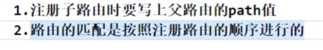

### 一、todoList案例总结

#### 1. 组件化编码流程  
     拆分组件时注意 className 、style的写法
          
#### 2. 数据在哪里，操作数据的方法就在哪里

#### 3. 关于父子之间的通信

    1. 父组件给子组件传递数据：通过props传递
    2. 子组件给父组件传递数据：通过props 需要父组件提前给子组件传递一个函数

#### 4.注意defaultCheck和checked的区别 

#### 5. 状态在哪里，操作状态的方法就在哪里

### 二、github搜索案列

### 三、路由的基本使用

### 四、路由组件与一般组件的区别

### 五、解决多级路径样式丢失问题

第二种方式 只适合React的脚手架创建的工程

### 六、路由的严格匹配与模糊匹配

### 七、嵌套路由

### 八、向路由组件传递参数

